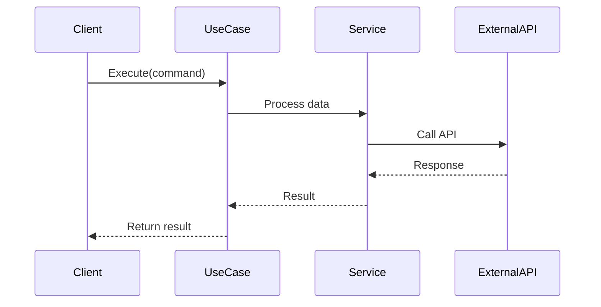
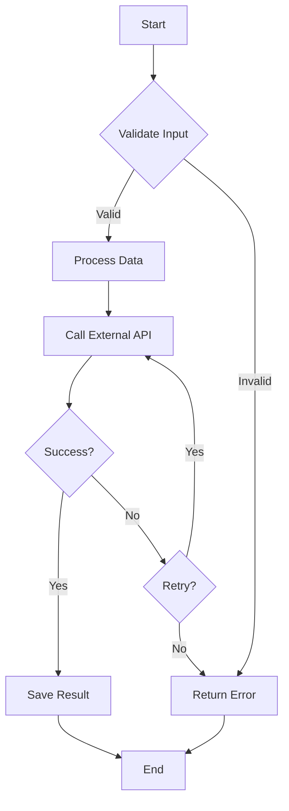

# Feature Specification: [Feature Name]

## Metadata

- **Status**: Draft | In Progress | Complete | Deprecated
- **Created**: YYYY-MM-DD
- **Last Updated**: YYYY-MM-DD
- **Author**: [Author Name]
- **Related ADRs**: [Link to relevant ADRs]
- **Related Specs**: [Link to related specs]

## Overview

Brief description of the feature and its purpose.

## Business Requirements

### User Stories

- **As a** [user type]
- **I want** [goal]
- **So that** [benefit]

### Acceptance Criteria

- [ ] Criterion 1
- [ ] Criterion 2
- [ ] Criterion 3

### Success Metrics

- Metric 1: Target value
- Metric 2: Target value

### Business Context

Why this feature is needed and how it fits into the larger system.

## Technical Specification

### Data Models

#### Input DTOs

```python
class FeatureCommand(BaseModel):
    """Input for FeatureUseCase"""
    field1: str
    field2: int
    field3: str | None = None
```

#### Output DTOs

```python
class FeatureResult(BaseModel):
    """Output from FeatureUseCase"""
    id: str
    status: str
    created_at: datetime
```

### API Contracts (if applicable)

#### Endpoint

- **Method**: POST | GET | PUT | DELETE
- **Path**: `/api/v1/feature`
- **Request Body**: `FeatureRequest`
- **Response**: `FeatureResponse`
- **Status Codes**: 200, 201, 400, 404, 500

### Data Flow



### Process Flow



### Dependencies

- **Internal**: List internal dependencies (use cases, services, etc.)
- **External**: List external dependencies (APIs, libraries, etc.)

### Error Handling

| Error Type | HTTP Status | Response Format |
|------------|-------------|-----------------|
| Validation Error | 400 | `{"error": "message"}` |
| Not Found | 404 | `{"error": "message"}` |
| External API Error | 502 | `{"error": "message"}` |
| Internal Error | 500 | `{"error": "message"}` |

## Implementation Notes

### Constraints

- Constraint 1
- Constraint 2

### Performance Considerations

- Performance requirement 1
- Performance requirement 2

### Edge Cases

- Edge case 1: How it's handled
- Edge case 2: How it's handled

### Testing Requirements

- Unit tests for use case
- Integration tests for API calls
- Error handling tests

## Implementation Checklist

- [ ] DTOs created in `application/dto/`
- [ ] Use case implemented in `application/usecase/`
- [ ] Gateway implemented (if needed) in `infrastructure/gateway/`
- [ ] Tests written
- [ ] Documentation updated
- [ ] Spec updated with actual implementation details

## References

- Related documentation links
- External API documentation
- Related ADRs

## Changelog

| Date | Author | Changes |
|------|--------|---------|
| YYYY-MM-DD | Name | Initial spec |
