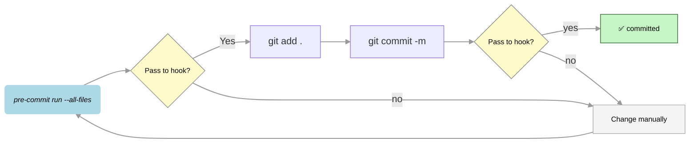

## 3. Rules Enforced (Ruff + Mypy)

Pre-commit runs **Ruff** (lint + format) and **Mypy** (type checking). Avoid these common failures:

| Check | Rule | What to do |
|-------|------|------------|
| **Ruff** | **SIM102** | Use a single `if` with `and` instead of nested `if` statements. |
| **Ruff** | **C901** | Keep function complexity ≤ 10. Extract helpers to reduce branches/loops. |
| **Ruff** | **E, F, B, I, UP** | Follow PEP 8, no undefined names, isort order, modern syntax. |
| **Mypy** | **attr-defined** | Narrow types before use (e.g. `isinstance(x, ast.Attribute)` then use `x.attr`). |
| **Mypy** | **arg-type** | Only pass the expected type (e.g. `set[str].add(str)`; guard with `isinstance(x, str)` for `ast.Constant.value`). |

- Run `uv run pre-commit run --all-files` before committing.
- After fixing, run again and re-stage any auto-fixed files.

## 4. Usage

### 4.1 Checks and Pre-commit Hooks

**Run all pre-commit checks**

```bash
pre-commit run --all-files
```

💡 This runs all configured checks. It's a great way to validate your code before committing.

**Run manual pre-commit hooks**

```bash
pre-commit run --all-files --hook-stage manual
```

💡 This command runs hooks that are defined as manual. Manual hooks are not executed automatically during commits but can be run explicitly when needed.

**📝 On Commit**

```bash
git commit -m "<message>"
```

💡 When you run `git commit`, ***pre-commit hooks*** will automatically execute and checks across the entire codebase by using mypy and ruff.

#### ⚙️ Pre-commit Hook Behavior and Commit Guidelines: Key Points

* 🔎 Check code compliance:

    Run `pre-commit run --all-files` to validate your code against the defined checks.

	* This command may also attempt to auto-fix some issues.

	* ⛔ If any checks fail, run it again to see if fixes were applied automatically. If not, you must manually fix the remaining issues and re-run the check.

	* Since files may be modified, always execute git add after running pre-commit.

* Staging and committing changes:

    * Stage your files with git add <files>.

	* Commit with git commit -m "...".

	* During commit, `pre-commit run --all-files` is executed automatically.

	* ⛔ If any checks fail, the commit is aborted.

	* 👨🏻‍💻 If issues persist, you'll need to address them manually before retrying the commit. After fix issues, `pre-commit run --all-files`, re-stage (git add), and commit again.

