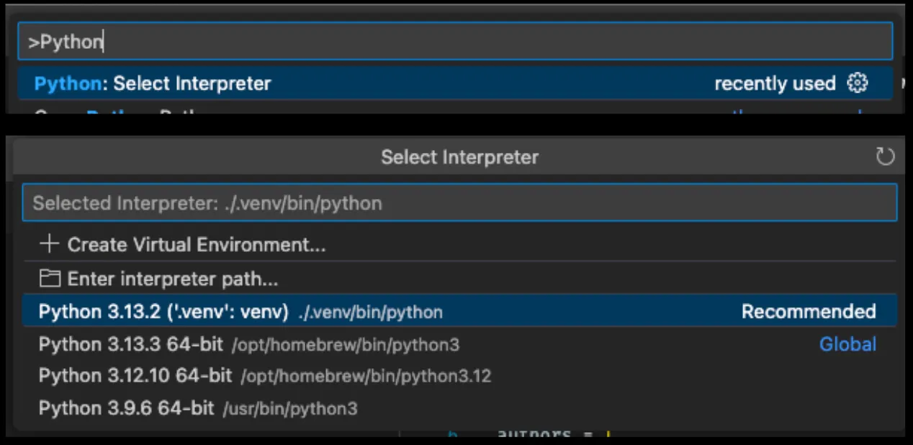

# UV Setup

> Reference: [uv practical guide](https://medium.com/@fernando.peres/uv-for-python-a-practical-guide-to-getting-started-d4408e3b082d)

## Installation

**UV** replaces pip, pip-tools, pipx, poetry, pyenv, twine, virtualenv, and more.

Install with:
```bash
# Using curl
curl -LsSf https://astral.sh/uv/install.sh | sh

# Using wget
wget -qO- https://astral.sh/uv/install.sh | sh

# Using brew
brew install uv
```

More options: [Official installation guide](https://docs.astral.sh/uv/getting-started/installation/)

## Python Version

This project requires Python >= 3.13.

```bash
# List available versions
uv python list

# Install Python 3.13
uv python install 3.13

# Pin version for this project
uv python pin 3.13
```

## Setup Environment

```bash
# Development (includes dev dependencies)
uv sync --all-groups

# Production (excludes dev dependencies)
uv sync
```

**Configure your IDE:**

You may also need to configure your IDE (VSCode/Cursor) to use this environment. With your IDE opened in your project folder:

1. Press `Command` + `Shift` + `P` (or `Ctrl` + `Shift` + `P` on Windows/Linux)
2. Type **Python: Select Interpreter**
3. Choose `./.venv/bin/python`


