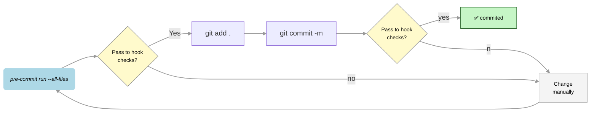

# Python Base - Template


---

## 1. Setup

This section helps you set up the Python environment and install pre-commit hooks.

---

⚠️ **Before you start:**

- This repository uses **`uv`** to manage dependencies. Install **`uv`** on your machine if needed.
- Ensure the Python version matches the one in `pyproject.toml` (>= 3.13).

💡 **Tip:** For installing `uv` and managing Python versions, see [UV Environment Setup Guide](docs/readme/readme-uv-env-setup.md).

---

**Step 1:** Create a virtual environment:

```sh
uv venv
```

**Step 2:** Activate the virtual environment:

```sh
source .venv/bin/activate
```

**Step 3:** Install dependencies (including development and optional groups):

```sh
uv sync --all-groups
```

**Step 4:** Install pre-commit hooks:

```sh
pre-commit install
```

💡 After this, pre-commit will run automatically on `git commit`. See [3.1 Checks and Pre-commit Hooks](#31-checks-and-pre-commit-hooks) for details.

---

## 2. Customization

### 2.1 Add a Package

```sh
uv add <package-name>
```

### 2.2 Add a Package as a Development Dependency

```sh
uv add --dev <package-name>
```

💡 Development dependencies are only installed in development environments and are excluded from production builds.

---

## 3. Usage

### 3.1 Running the Application

To run the application, use the provided script:

```bash
./run.sh
```

The script loads `.env`, sets `PYTHONPATH`, and runs the service via `uv run python main.py`.

### 3.2 Checks and Pre-commit Hooks

**Run all pre-commit checks**

```bash
pre-commit run --all-files
```

💡 This runs all configured checks (e.g. Ruff, mypy). Some issues may be auto-fixed.

**Run manual pre-commit hooks**

```bash
pre-commit run --all-files --hook-stage manual
```

💡 Manual hooks (e.g. pytest) are not run on commit; use this to run them explicitly.

**On commit**

```bash
git commit -m "<message>"
```

💡 Pre-commit hooks run automatically on `git commit`. If checks fail, the commit is aborted.

#### Pre-commit hook behavior: key points

- **Check compliance:** Run `pre-commit run --all-files` to validate code. Re-run after auto-fixes; if checks still fail, fix issues manually.
- **Staging:** After pre-commit may modify files, run `git add` again, then `git commit`.
- **On failure:** Fix issues, run `pre-commit run --all-files`, re-stage, and commit again.



**Tips:** Commit often. Ruff and mypy can auto-fix many issues; others require manual fixes.

### 3.3 Configuration (local development)

This project uses Pydantic Settings for configuration. Configuration is loaded from the `.env` file in the project root.

**Environment and secrets**

1. Use `.env.example` as a reference and edit `.env` with the appropriate values for your environment.

**Using settings in code**

See [Settings in Code Guide](docs/readme/readme-settings-in-code.md).

---

## 4. Testing

The project uses **pytest** with coverage. Run the test suite with:

```sh
pytest
```

Run with detailed coverage:

```sh
pytest --cov=service --cov-report=term-missing
```

Pytest is configured in `pyproject.toml`. A pytest hook is also available as a **manual** pre-commit hook (see [3.2](#32-checks-and-pre-commit-hooks)).

---

## 5. Linters

The following tools are configured in `pyproject.toml` and run via pre-commit:

- **mypy** – static type checking
- **ruff** – linting and formatting

Run them with:

```sh
pre-commit run --all-files
```

---

## 6. Project information

### Service layout

Current layout:

```
service/
├── config/
│   ├── bootstrap.py
│   ├── settings.py
│   └── vocabulary.py
├── main.py
└── shared/
    ├── __init__.py
    ├── logger.py
    ├── registry.py
    └── terminal_colors.py
```

- **config/** – bootstrap, settings, vocabulary  
- **shared/** – logger, registry, terminal colors, utilities  

For more on architecture and messaging, see `docs/architecture/` and `docs/readme/`.
